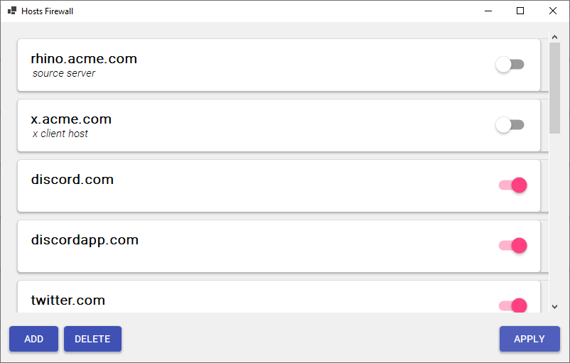
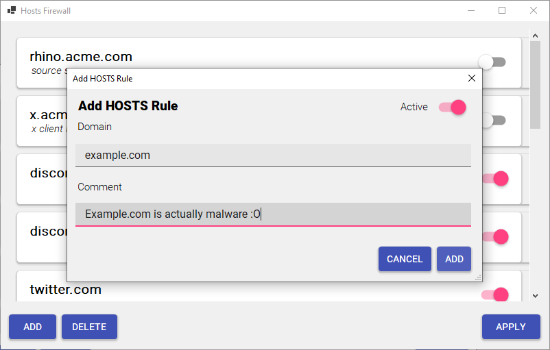
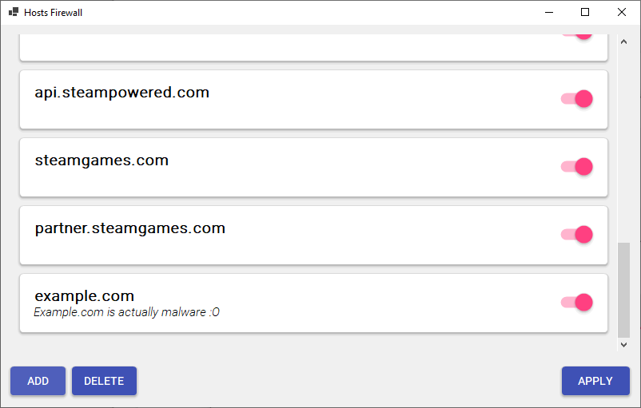

# HOSTS Firewall
A material design HOSTS based firewall for Windows
> *For when you want to socially isolate yourself from the world*

----

HOSTS Firewall is a GUI based application designed to help you use your HOSTS file as a firewall intuitively, simplifying the process of blocking domain names to a few button clicks.

# Screenshots

# License
HOSTS Firewall is licensed under the MIT License, see [LICENSE.txt](https://www.github.com/hyblocker/hosts-firewall/LICENSE.txt) for more information.

